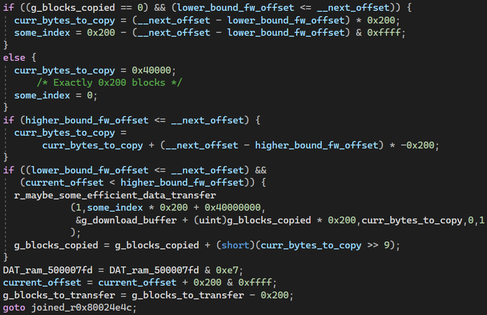

# CVE-2024-42642

## Introduction
The device in question is any MX500-series SSD. These SSDs are controlled by a Sillicon-Motion `SM2259` controller (older batches had an older controller, Sillicon-Motion `SM2258`).
`SM2259` is a 4-channel SATA 6Gb/s micro-controller which sports a 32-bit little-endian CPU based on the ARC architecture. 
By observing the latest firmware applicable for the date of this document, which is `M3CR046`, a few issues were identified and confirmed both statically and dynamically.
All of the issues were identified in the firmware update mechanism of the controller, which corresponds to the micro-controller handler of `ATA PIO DOWNLOAD-MICROCODE (0x92)` command, specifically in the logic that downloads the firmware using the offsets method, which corresponds to subcommands `0x03` and `0x0E`.
All the bugs that are covered in this document were verified on Crucial MX500 500GB SSD (`CT500MX500SSD1`) running `M3CR046` FW, using a PC with an `x86_64` CPU.

The FW code is mapped to base address `0x80020000`, and the vulnerable ATA handler is located at address `0x80024A9C`. A decompiled version of the function can be found under `resources/download_microcode_handler.c` for your convenience.

## Bug #1
This issue refers to cases in which the first chunk sent is of size larger than `0x200` sectors. If we take a look inside the ATA command handler, specifically at the logic that is executed when the chunk size is larger than sector size and when the chunk is the first one sent:


This sets some variables based on the next offset (which in our case, since we only sent a single chunk so far, is the chunk’s length in sectors) and on a variable named `lower_bound_fw_offset` which is the block offset (i.e., offset in granularity of sectors) within the input download image our firmware image is expected to be found. This is a hardcoded value, which in our case, is equal to 0. 
In this case, an underflow occurs when calculating the subtraction result for `some_index`, causing some_index to be as high as `0xFFFF`. This is unexpected behavior, as based on the logic that moves the data to the download buffer:


We observe that the source address from which the data is copied might not be valid given the unexpected value calculated for `some_index`.
When testing this dynamically by sending a firmware update request with the first chunk being of size larger than `0x200` sectors, the controller hangs and does not even send a response to the original request. This is consistent and easily reproducible.
It is likely that this happens due to an invalid reference to the computed source address, which then triggers an exception that causes the controller hang. This has not been proven, but rather a conjecture that might explain the hang.

## Bug #2
The input download image (for `M3CR046`) is of size `0x242400` bytes, and inside this image there are 3 internal firmware images that only one of them is eventually written to flash after a firmware update process, each such image is of size `0xC0C00` bytes (or `0x606` sectors).
That means, that when the firmware update mechanism extracts the correct firmware copy from the input download image, it must verify that its size does not exceed `0xC0C00` bytes.
The controller indeed attempts to do so, but there are some corner cases that can lead to unexpected behavior. Let us take a look at the following snippet (which shares some code with the previous bug):


If the current chunk is of size greater than `0x200` sectors and it is not the first chunk in the sequence, then `0x200` sectors (`0x40000` bytes) will be copied at a time. Then, there is a check whose purpose is to truncate the excess bytes from the number of bytes to copy if the total size of the firmware image exceeds `higher_bound_fw_offset` (which in our case, is `0x606` sectors, since the firmware size should be exactly this).
This logic makes sense overall, but there is a flaw – if the last chunk that is sent causes the next offset to become too high, such that the excess number of bytes exceeds `0x200` sectors (or `0x40000` bytes), then curr_bytes_to_copy gets a “negative” value, which underflows to about `~4GB (~0xFFFFFFFF)`. Like we saw before, this variable is used to determine the number of bytes to be transferred to the download buffer.
If we take a look inside `r_maybe_some_efficient_data_transfer`, we see the following piece of code:


Which means that the copy size is truncated to `32MB` (from the original `~4GB` copy size), but that is still a large number which might also cause an undefined behavior if the memory range starting at `0x40000000` is of size less than `32MB`.
When testing this dynamically by sending ATA chunks to arrive at an offset of `0x600`, and then sending a large chunk of size `0x207` sectors to trigger the underflow, the controller hangs yet again, probably due to an invalid memory access during copy.
This bug is more interesting than the previous one, because even though we do not have a controlled overwrite (but rather, a big overwrite that possibly triggers an exception which hangs the controller), if the function that moves the data to the download buffer actually manages to transfer that much data before crashing (overwriting the memory range which is located right after the download buffer in main memory), then perhaps the exception handler’s behavior may be altered based on the overwritten data. That can possibly happen, if, for instance, the exception handler reads a pointer from the overwritten area and then jumping to it (this specific case is not particularly likely, but with some more research, something of the sort might be discovered).

## Bug #3
As stated, the size of the download image is of size `0x242400` (or `0x1212` sectors). The firmware verifies that the total size of the transferred image does not exceed this size by verifying that the next offset does not exceed `0x1212` sectors. This check makes sense, but the computation of the next offset is flawed:


If the current offset is `0x600 sectors`, and the next ATA command to be processed is of size large enough (say `0xFC00` sectors, which is permitted by the ATA standard), then the next offset wraps around, such that the aforementioned check does not work properly:


Or in other words, in the usual case, the firmware update mechanism would reset its state machine and return an error, but if we sent a very large chunk, we would continue processing it.
The following code snippet shows how the transfer is done:



We recall at this point that if the number of sectors to transfer is larger than `0x200` sectors and the current chunk is not the first one, then `0x200` sectors are copied at a time to the download buffer. This is very interesting, because this means that we can copy about `0x200` sectors (or `0x40000` bytes) beyond the download buffer, overwriting data in main memory. For example, if the current offset is `0x605` sectors and we supply a chunk size of `0xF9FB` sectors, then `__next_offset` gets the value of 0 due to the wrap around. The source index from which the copy begins is 0, and curr_bytes_to_copy gets the value of `0x40000`. Since we are currently at offset `0x605` sectors, then `g_blocks_copied` gets the value of `0x605`. As the current offset is indeed valid (and the next one too), then the copy operation to the download buffer is triggered, causing a massive overwrite of slightly less than `0x40000` bytes beyond the end of the download buffer.
This is a strong primitive that allows for a much more controller buffer overflow (which does not crash the controller immediately like in the previous cases), and can lead to code execution with a much higher certainty than the previous bug (but still, more research needs to be done about what exactly is placed after the download buffer in main memory to determine the characteristics of exploitation).

## Bug Reproduction and Comments
All these bugs were verified on an Ubuntu 22.04 64-bit machine using the standard Linux SCSI driver over the `SG_IO` interface. It should be pointed out that to reproduce Bug 3 with this specific driver, huge pages must be enabled and a single 1GB page must be allocated for the large request. The reason for this is that seemingly, this driver requires the entire ATA request to be in a continuous physical memory block. As the request is of size close to `~30MB`, `2MB` pages are not enough, and thus `1GB` pages is the next (and last) available size on our test system.
However, it should also be noted that it is does not mean that this is a necessary step to trigger this because perhaps there are other workarounds that allow sending large ATA requests that we have not covered yet. Enabling huge-pages was simply the fastest route to confirm this bug. Besides this, the only prerequisite required to trigger all these bugs is the necessary permissions to send ATA packets (typically, root access to the PC communicating with the controller).

The source code that reproduces all of the aforementioned bugs is provided as part of this repository.
For Bug #1 and Bug #2, the expected behavior is for the drive to hang until the next power cycle.
For Bug #3, the provided source code does not necessarily crash the controller, but it does perform a large overwrite beyond the download buffer. 

## Compiling & Running
As stated, as the bugs were verified on an Ubuntu 22.04 64-bit machine, the compilation process must be done on a similar machine. There are no guarantees for other distributions or operating systems.

To build, run the following in the root directory of the project:
```
cmake -B build && make
```

The build process builds 3 binaries, all of which will be available in the `build` directory with the names `CVE_MX500_BUG_1`, `CVE_MX500_BUG_2` and `CVE_MX500_BUG_3` which correspond to the source files that trigger Bug #1, Bug #2 and Bug #3, respectively.

Each binary expects to receive the device path of the MX500 SSD, and must be run with root privileges. For example:

```
sudo ./build/CVE_MX500_BUG1 /dev/sda
```

## Disclosure
This CVE is currently RESERVED by MITRE and awaiting review.

## Final Notes
If you have identified inaccuracies or mistakes in the description or that you are having trouble to reproduce these bugs, please reach me at log1kxd at gmail.com.
